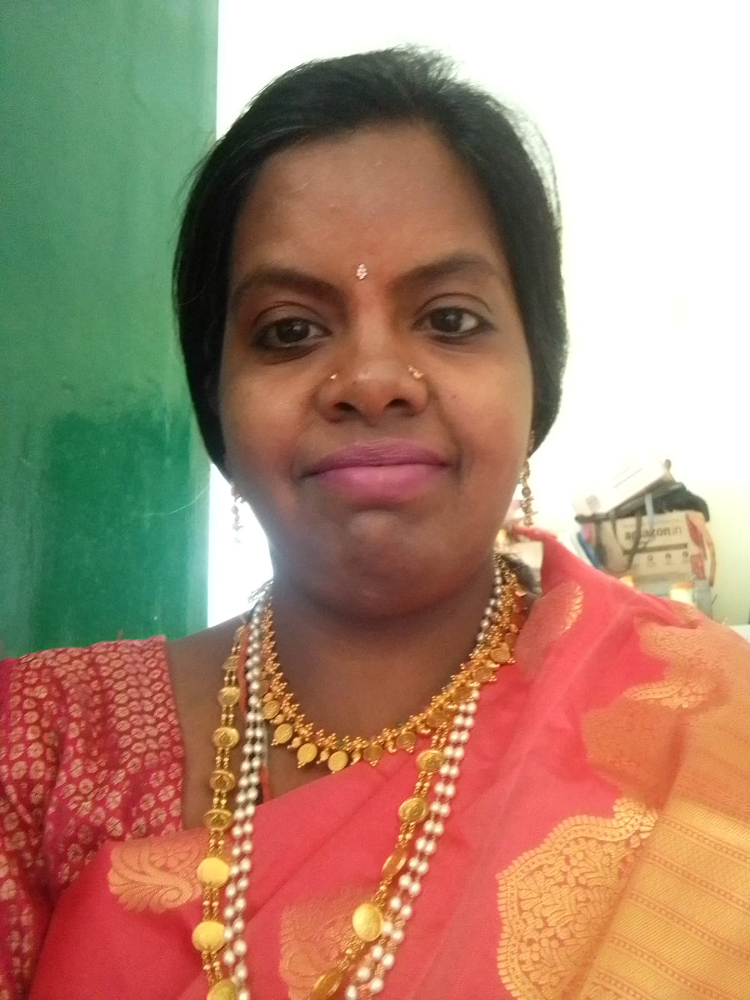

|  |  |  |
|-------------|----------------------------------------------|-------------|
|  | I am a South Indian from *Tirupati*, Andhra Pradesh, and a native Telugu speaker. My career spans roles as a Software Developer, Technical Writer, and Data Scientist, working with clients such as *Ford, Novartis, Takeda, ThyssenKrupp, Parryware, Acacia, T-Mobile, and BGS Global*. |  |
| *Work Experience* | My experience includes Technical Writing, Project and Product Management, Data Analysis, MLOps support, project documentation (SOW, PRD), root cause analysis, cross-skills training, stakeholder presentations using visualization tools, managing multiple projects and teams, and serving as an SME for troubleshooting ad-hoc projects. |  |
| Education | BE in Computer sc from MVjCE,BU. |  |
| Certifications | ***DASCA*** certified *Principal Data Scientist* \| *Nextleap* certified *Product Management* \| |  |
| *Primary Skills* | R,R Shiny,Python,Machine Learning,Tableau,SQL |  |
| *Secondary Skills* | Deployment using AWS MLOPS,Data Engineering,Product Management,Project Management,Technical Documentation |  |
| *Hobbies* | My Hobbies *Classical BharatNatyam Dancer,Pilgrimage,Cooking* |  |

[Back-to-home](index.html)
